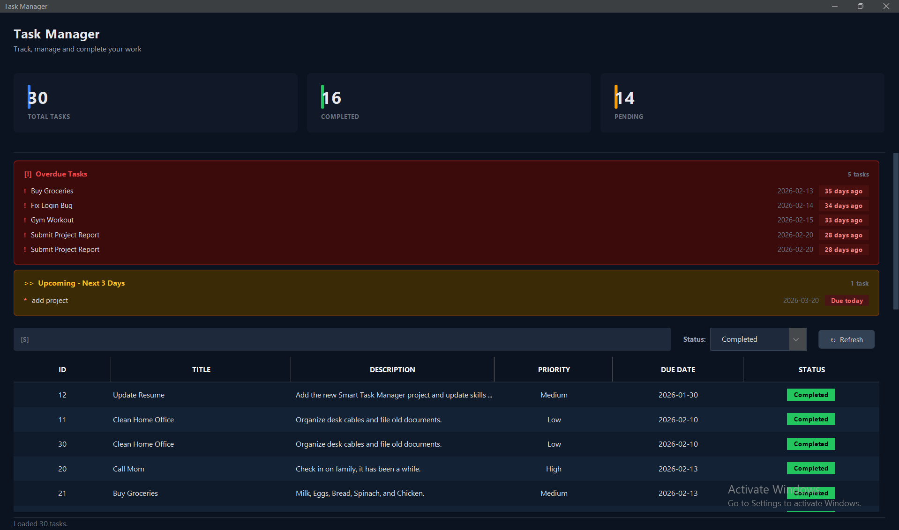

# SmartTaskManager

A production-quality desktop Task Manager built with **Java Swing**, following clean architecture principles. Features a modern dark-themed dashboard UI, full CRUD task management, overdue/upcoming alerts, and a MySQL backend.

---

## Table of Contents

- [Screenshots](#screenshots)
- [Features](#features)
- [Tech Stack](#tech-stack)
- [Project Structure](#project-structure)
- [Architecture](#architecture)
- [Database Setup](#database-setup)
- [Configuration](#configuration)
- [Running the Application](#running-the-application)
- [Dependencies](#dependencies)
- [Design System](#design-system)
- [Class Reference](#class-reference)
- [Contributing](#contributing)

---
## Screenshots

| Dashboard | Overdue & Upcoming Alerts |
|-----------|--------------------------|
| (docs/TaskManager3.png) |  |

---

## Features

### Task Management
- **Add tasks** with title, description, priority (Low / Medium / High), and due date
- **Complete tasks** — single-click status transition from Pending to Completed
- **Delete tasks** with a confirmation dialog
- **Search tasks** — live filter across title and description as you type
- **Filter by status** — All / Pending / Completed via dropdown

### Dashboard
- **KPI stat cards** — Total Tasks, Completed, Pending counts update on every data load
- **Sticky header** — stat cards stay visible while the content area scrolls

### Alert System
- **Overdue Tasks panel** — shows up to 5 tasks past their due date, not yet completed; displays how many days overdue each task is
- **Upcoming Tasks panel** — shows tasks due within the next 3 days, colour-coded by urgency:
  - 0–1 days → Red
  - 2 days → Orange
  - 3 days → Yellow
- Both panels are hidden automatically when empty

### UI/UX
- Full-page scroll — the entire content area scrolls when the window is too short
- Hover row highlight on the task table
- Zebra-striped table rows
- Solid-fill status badges (amber for Pending, green for Completed) with black text for maximum contrast
- Blue focus ring on all input fields and the search bar
- Date picker via `JSpinner` (no manual date format memorisation)
- Empty-state illustration when no tasks exist
- WCAG AA compliant colour contrast throughout

---

## Tech Stack

| Layer | Technology |
|---|---|
| Language | Java 17+ |
| UI Framework | Java Swing |
| Look & Feel | FlatLaf (FlatDarkLaf) |
| Database | MySQL 8.x |
| JDBC Driver | mysql-connector-j |
| Build Tool | Maven (or Gradle) |
| Logging | java.util.logging (JUL) |

---

## Project Structure

```
SmartTaskManager/
├── src/
│   └── main/
│       └── java/
│           └── com/
│               └── taskmanager/
│                   ├── GUIMain.java              # Entry point — bootstraps logging, L&F, and UI
│                   ├── TaskUI.java               # Main Swing window (1 300 lines)
│                   ├── config/
│                   │   └── DatabaseConnection.java  # DriverManager wrapper, env-var config
│                   ├── dao/
│                   │   └── TaskDAO.java          # SQL CRUD via PreparedStatement
│                   ├── model/
│                   │   └── Task.java             # Domain model with validation
│                   └── service/
│                       └── TaskService.java      # Business logic layer
├── pom.xml                                       # Maven dependencies
└── README.md
```

---

## Architecture

The project follows a **three-layer clean architecture**:

```
┌─────────────────────────────────────┐
│           Presentation Layer        │
│   TaskUI.java   ←   GUIMain.java   │
└────────────────┬────────────────────┘
                 │ calls
┌────────────────▼────────────────────┐
│            Service Layer            │
│         TaskService.java            │
│  (validation, business rules,       │
│   search, filtering, reporting)     │
└────────────────┬────────────────────┘
                 │ delegates to
┌────────────────▼────────────────────┐
│          Data Access Layer          │
│           TaskDAO.java              │
│  (SQL only — no business logic)     │
└────────────────┬────────────────────┘
                 │ connects via
┌────────────────▼────────────────────┐
│         Infrastructure Layer        │
│      DatabaseConnection.java        │
│   (DriverManager + env-var config)  │
└─────────────────────────────────────┘
```

**Key principles applied:**
- `TaskService` is injected into `TaskUI` via constructor — the UI never touches the DAO directly
- `TaskDAO` uses `PreparedStatement` everywhere — zero SQL injection risk
- All connections use try-with-resources — zero connection leaks
- `Task` model validates all fields in setters — the object can never be in an illegal state
- All heavy work runs on a `SwingWorker` background thread — the EDT is never blocked

---

## Database Setup

### 1. Create the database

```sql
CREATE DATABASE task_manager_db;
USE task_manager_db;
```

### 2. Create the tasks table

```sql
CREATE TABLE tasks (
    id          INT AUTO_INCREMENT PRIMARY KEY,
    title       VARCHAR(150)  NOT NULL,
    description VARCHAR(500),
    priority    ENUM('Low', 'Medium', 'High') NOT NULL DEFAULT 'Medium',
    due_date    DATE          NOT NULL,
    status      ENUM('Pending', 'Completed')  NOT NULL DEFAULT 'Pending',
    created_at  TIMESTAMP DEFAULT CURRENT_TIMESTAMP
);
```

### 3. (Optional) Seed test data

```sql
INSERT INTO tasks (title, description, priority, due_date, status) VALUES
  ('Fix Login Bug',         'Auth token expires too early',   'High',   CURDATE() - INTERVAL 2 DAY, 'Pending'),
  ('Write Unit Tests',      'Cover TaskService methods',      'Medium', CURDATE() + INTERVAL 1 DAY, 'Pending'),
  ('Deploy to Staging',     'Push v1.2 build',                'High',   CURDATE() + INTERVAL 3 DAY, 'Pending'),
  ('Update README',         'Add architecture diagram',       'Low',    CURDATE() + INTERVAL 7 DAY, 'Pending'),
  ('Code Review',           'Review PR #42',                  'Medium', CURDATE() - INTERVAL 1 DAY, 'Completed');
```

---

## Configuration

Database credentials are read from **environment variables** at startup. The application never reads credentials from source code.

| Variable | Description | Default (local dev only) |
|---|---|---|
| `DB_URL` | Full JDBC connection URL | `jdbc:mysql://localhost:3306/task_manager_db` |
| `DB_USER` | Database username | `root` |
| `DB_PASSWORD` | Database password | *(empty)* |

### Setting environment variables

**Windows (PowerShell):**
```powershell
$env:DB_URL      = "jdbc:mysql://localhost:3306/task_manager_db?useSSL=false&serverTimezone=UTC"
$env:DB_USER     = "app_user"
$env:DB_PASSWORD = "your_password"
```

**macOS / Linux:**
```bash
export DB_URL="jdbc:mysql://localhost:3306/task_manager_db?useSSL=false&serverTimezone=UTC"
export DB_USER="app_user"
export DB_PASSWORD="your_password"
```

> **Note:** If environment variables are not set, the application falls back to the default values above. This is intentional for frictionless local development. Always set real credentials in any shared or production environment.

---

## Running the Application

### Prerequisites

- Java 17 or later
- MySQL 8.x running locally
- Maven 3.8+

### Steps

```bash
# 1. Clone the repository
git clone https://github.com/your-username/SmartTaskManager.git
cd SmartTaskManager

# 2. Set database credentials (see Configuration section above)

# 3. Build the project
mvn clean package

# 4. Run the application
java -jar target/SmartTaskManager-1.0.jar
```

Or run directly from your IDE by executing `GUIMain.main()`.

---

## Dependencies

Add these to your `pom.xml`:

```xml
<dependencies>

    <!-- MySQL JDBC Driver -->
    <dependency>
        <groupId>com.mysql</groupId>
        <artifactId>mysql-connector-j</artifactId>
        <version>8.3.0</version>
    </dependency>

    <!-- FlatLaf — modern dark look and feel for Swing -->
    <dependency>
        <groupId>com.formdev</groupId>
        <artifactId>flatlaf</artifactId>
        <version>3.4</version>
    </dependency>

</dependencies>
```

For Gradle:

```groovy
dependencies {
    implementation 'com.mysql:mysql-connector-j:8.3.0'
    implementation 'com.formdev:flatlaf:3.4'
}
```

---

## Design System

All colours are defined as named constants at the top of `TaskUI.java` and map directly to the project's CSS-style design tokens.

### Backgrounds

| Constant | Hex | Usage |
|---|---|---|
| `BG_BASE` | `#0B1220` | Window background |
| `BG_SURFACE` | `#111827` | Cards, table background |
| `BG_SURFACE_ALT` | `#132235` | Zebra even rows |
| `BG_SURFACE_HOVER` | `#1E293B` | Table row hover |
| `BG_INPUT` | `#1E293B` | Input fields |
| `BG_OVERDUE` | `#3B0A0A` | Overdue alert card |
| `BG_UPCOMING` | `#3A2A05` | Upcoming alert card |

### Text

| Constant | Hex | Contrast on surface | Usage |
|---|---|---|---|
| `TEXT_PRIMARY` | `#E5E7EB` | 13.5:1 ✅ | Table content, headings |
| `TEXT_SECONDARY` | `#9CA3AF` | 6.8:1 ✅ | Labels, subtitles |
| `TEXT_MUTED` | `#6B7280` | 4.6:1 ✅ | Placeholders, status bar |
| `TEXT_HEADER` | `#FFFFFF` | 15.8:1 ✅ | Column headers |

### Status Badges

| Status | Background | Text | Contrast |
|---|---|---|---|
| Pending | `#F59E0B` (amber) | `#000000` | 11.8:1 ✅ |
| Completed | `#22C55E` (green) | `#000000` | 7.2:1 ✅ |

### Urgency Colours (Alert Panels)

| Days Left | Text Colour | Meaning |
|---|---|---|
| Overdue | `#EF4444` Red | Past due date |
| 0–1 | `#FF6B6B` Bright Red | Critical |
| 2 | `#FB923C` Orange | Urgent |
| 3 | `#FBBF24` Yellow | Warning |

---

## Class Reference

### `GUIMain`
Entry point. Configures `java.util.logging`, applies `FlatDarkLaf`, then launches `TaskUI` on the Event Dispatch Thread via `SwingUtilities.invokeLater`.

### `TaskUI`
Main application window (`JFrame`). Assembles the full UI layout:
- Sticky header (title + KPI stat cards) — always visible
- Scrollable content area — overdue/upcoming alerts, toolbar, table, form
- Sticky status bar — always visible at the bottom

All background data fetching uses `SwingWorker` so the EDT is never blocked.

### `TaskService`
Business logic layer. All methods validate their inputs before delegating to `TaskDAO`. Key methods:

| Method | Description |
|---|---|
| `addTask(Task)` | Validates and persists a new task; forces status to Pending |
| `markTaskCompleted(int)` | Idempotent status update to Completed |
| `completeTask(int)` | Backward-compatible alias for `markTaskCompleted` |
| `deleteTask(int)` | Permanently removes a task by ID |
| `getAllTasks()` | Returns all tasks in database order |
| `searchTasks(String)` | Case-insensitive search across title and description |
| `filterByStatus(String)` | Returns tasks matching Pending or Completed |
| `filterByPriority(String)` | Returns tasks matching Low, Medium, or High |
| `getTasksSortedByDate()` | Returns all tasks sorted by due date ascending |
| `generateReport()` | Returns a `ProductivityReport` value object with totals and efficiency % |

### `TaskDAO`
Data access layer. All SQL is written as named string constants. Key design decisions:
- `addTask` retrieves and sets the generated primary key back onto the `Task` object
- `findById` returns `Optional<Task>` — callers cannot get a null back
- `getAllTasks` returns `Collections.emptyList()` on failure — never a partial list
- `mapRow(ResultSet)` and `bindTaskFields(PreparedStatement, Task)` are shared by all read/write paths so schema changes touch one place

### `Task`
Domain model. All fields are private with validated setters. Notable behaviour:
- `setStatus` and `setPriority` normalise casing — `"high"` becomes `"High"`
- `setDueDate` and `getDueDate` use defensive copies — external references cannot mutate the stored date
- `equals`/`hashCode` are based on `id` only — consistent with database identity
- `isPersisted()` — returns true if the DAO has written the task (id > 0)
- `isOverdue()` — returns true if due date is before today

### `DatabaseConnection`
Infrastructure class. Reads `DB_URL`, `DB_USER`, `DB_PASSWORD` from environment variables with a local fallback. Validates the URL format and username before attempting any connection. Registers the MySQL JDBC driver once at class load and fails fast if the driver JAR is missing.

---

## Contributing

1. Fork the repository
2. Create a feature branch: `git checkout -b feature/your-feature-name`
3. Follow the existing layer boundaries — UI code stays in `TaskUI`, business rules stay in `TaskService`, SQL stays in `TaskDAO`
4. Add input validation for any new fields in `Task` setters
5. Use `SwingWorker` for any operation that touches the database from the UI
6. Submit a pull request with a description of the change

---

